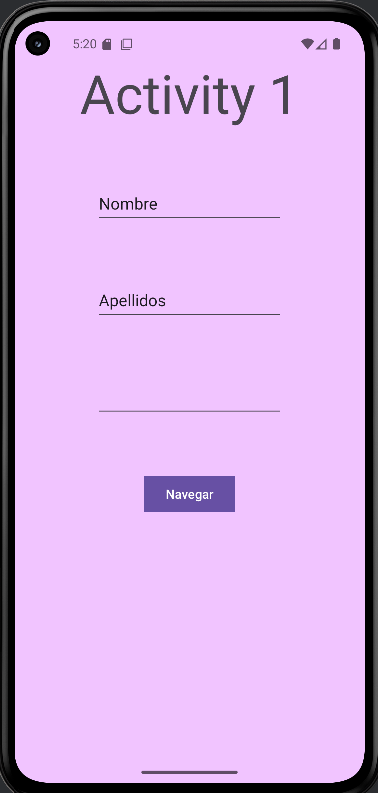
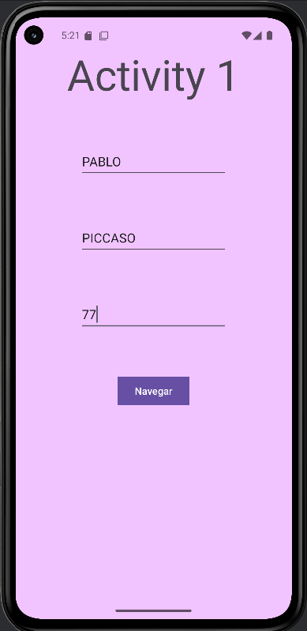
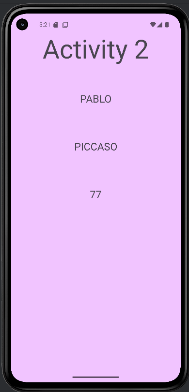

# PRÁCTICA PASAR PARÁMETROS

> En esta práctica realizaremos una aplicación en donde al insertar 2 Strings que serían el nombre y apellidos y 
> 1 int cualquiera, lo pasaremos a la segunda actividad que tengamos y lo mostraremos en pantalla.

## LO QUE USAREMOS 

1. GitHub
2. Markdown
3. Kotlin
    - Intent
    - PutExtra
    - Botones
    - Funciones
    - Constantes

## CÓDIGO ACTIVITYS

### MAIN ACTIVITY

``` kotlin
package es.dam.comunicacion

import android.content.Intent
import android.os.Bundle
import android.view.View
import android.widget.EditText
import androidx.activity.enableEdgeToEdge
import androidx.appcompat.app.AppCompatActivity

class MainActivity : AppCompatActivity() {
    companion object{
        const val EXTRA_PERSONA = "persona"
    }
    override fun onCreate(savedInstanceState: Bundle?) {
        super.onCreate(savedInstanceState)
        enableEdgeToEdge()
        setContentView(R.layout.activity_main)
    }

    fun irSegunda(v: View){
        val nombre = findViewById<EditText>(R.id.txtNombre)
        val apellidos = findViewById<EditText>(R.id.txtApellidos)
        val edad = findViewById<EditText>(R.id.txtEdad)
        val persona: Persona = Persona(nombre.text.toString(), apellidos.text.toString(), edad.text.toString().toIntOrNull()?:0);
        val intent = Intent(this, SecondActivity::class.java)
        intent.putExtra(EXTRA_PERSONA, persona)
        startActivity(intent)

    }

}
```

### SECOND ACTIVITY

``` kotlin
package es.dam.comunicacion

import android.os.Build
import android.os.Build.VERSION
import android.os.Bundle
import android.widget.EditText
import android.widget.TextView
import android.widget.Toast
import androidx.activity.enableEdgeToEdge
import androidx.appcompat.app.AppCompatActivity
import androidx.core.view.ViewCompat
import androidx.core.view.WindowInsetsCompat

class SecondActivity : AppCompatActivity() {
    override fun onCreate(savedInstanceState: Bundle?) {
        super.onCreate(savedInstanceState)
        enableEdgeToEdge()
        setContentView(R.layout.activity_second)
        val persona = if (VERSION.SDK_INT >= Build.VERSION_CODES.TIRAMISU) {
            intent.getParcelableExtra(MainActivity.EXTRA_PERSONA, Persona::class.java)
        } else {
            @Suppress("DEPRECATION")
            intent.getParcelableExtra<Persona>(MainActivity.EXTRA_PERSONA)
        }
        findViewById<TextView>(R.id.txtSecNombre).text = persona?.nombre.toString()
        findViewById<TextView>(R.id.txtSecApellidos).text = persona?.apellidos.toString()
        findViewById<TextView>(R.id.txtSecEdad).text = persona?.edad.toString()
    }
}
```

### DATA CLASE PERSONA

``` kotlin
package es.dam.comunicacion

import android.os.Parcel
import android.os.Parcelable

data class Persona(
    val nombre: String?,
    val apellidos: String?,
    val edad: Int
): Parcelable{

    //Convierte un parcel en un objeto de tipo Persona
    constructor(source: Parcel):this(
        source.readString()!!,
        source.readString()!!,
        source.readInt()
    )

    override fun describeContents(): Int {
        return 0;
    }

    // Convierte el objeto persona en un parcel
    override fun writeToParcel(p0: Parcel, p1: Int) {
        p0.writeString(nombre);
        p0.writeString(apellidos);
        p0.writeInt(edad);
    }

    companion object CREATOR : Parcelable.Creator<Persona> {
        override fun createFromParcel(parcel: Parcel): Persona {
            return Persona(parcel)
        }

        override fun newArray(size: Int): Array<Persona?> {
            return arrayOfNulls(size)
        }
    }

    override fun toString(): String {
        return "$nombre $apellidos $edad"
    }
}
```

## CODIFO LAYOUT

### ACTIVITY_MAIN

``` xml
<?xml version="1.0" encoding="utf-8"?>
<androidx.constraintlayout.widget.ConstraintLayout xmlns:android="http://schemas.android.com/apk/res/android"
    xmlns:app="http://schemas.android.com/apk/res-auto"
    xmlns:tools="http://schemas.android.com/tools"
    android:id="@+id/main"
    android:layout_width="match_parent"
    android:layout_height="match_parent"
    android:background="#F1C4FF"
    tools:context=".MainActivity">

    <Button
        android:id="@+id/btnNavegar"
        android:layout_width="wrap_content"
        android:layout_height="wrap_content"
        android:layout_marginTop="60dp"
        android:onClick="irSegunda"
        android:text="@string/Navegar"
        app:cornerRadius="0dp"
        app:layout_constraintEnd_toEndOf="@+id/txtEdad"
        app:layout_constraintStart_toStartOf="@+id/txtEdad"
        app:layout_constraintTop_toBottomOf="@+id/txtEdad" />

    <EditText
        android:id="@+id/txtNombre"
        android:layout_width="wrap_content"
        android:layout_height="wrap_content"
        android:layout_marginTop="60dp"
        android:ems="10"
        android:inputType="text"
        android:minHeight="48dp"
        android:text="@string/Nombre"
        app:layout_constraintEnd_toEndOf="@+id/txtActividad1"
        app:layout_constraintStart_toStartOf="@+id/txtActividad1"
        app:layout_constraintTop_toBottomOf="@+id/txtActividad1" />

    <EditText
        android:id="@+id/txtApellidos"
        android:layout_width="wrap_content"
        android:layout_height="wrap_content"
        android:layout_marginTop="60dp"
        android:ems="10"
        android:inputType="text"
        android:minHeight="48dp"
        android:text="@string/Apellidos"
        app:layout_constraintEnd_toEndOf="@+id/txtNombre"
        app:layout_constraintStart_toStartOf="@+id/txtNombre"
        app:layout_constraintTop_toBottomOf="@+id/txtNombre" />

    <EditText
        android:id="@+id/txtEdad"
        android:layout_width="wrap_content"
        android:layout_height="wrap_content"
        android:layout_marginTop="60dp"
        android:ems="10"
        android:inputType="number"
        android:minHeight="48dp"
        app:layout_constraintEnd_toEndOf="@+id/txtApellidos"
        app:layout_constraintStart_toStartOf="@+id/txtApellidos"
        app:layout_constraintTop_toBottomOf="@+id/txtApellidos"
        tools:text="0" />

    <TextView
        android:id="@+id/txtActividad1"
        android:layout_width="wrap_content"
        android:layout_height="wrap_content"
        android:layout_marginTop="40dp"
        android:text="@string/Actividad1"
        android:textSize="60sp"
        app:layout_constraintEnd_toEndOf="parent"
        app:layout_constraintStart_toStartOf="parent"
        app:layout_constraintTop_toTopOf="parent" />

</androidx.constraintlayout.widget.ConstraintLayout>
```

### ACTIVITY_SECOND

``` xml
<?xml version="1.0" encoding="utf-8"?>
<androidx.constraintlayout.widget.ConstraintLayout xmlns:android="http://schemas.android.com/apk/res/android"
    xmlns:app="http://schemas.android.com/apk/res-auto"
    xmlns:tools="http://schemas.android.com/tools"
    android:id="@+id/main"
    android:layout_width="match_parent"
    android:layout_height="match_parent"
    android:background="#F1C4FF"
    tools:context=".SecondActivity">

    <TextView
        android:id="@+id/txtSecApellidos"
        android:layout_width="350dp"
        android:layout_height="50dp"
        android:layout_marginTop="60dp"
        android:text="@string/Apellidos"
        android:textAlignment="center"
        android:textSize="24sp"
        app:layout_constraintEnd_toEndOf="@+id/txtSecNombre"
        app:layout_constraintHorizontal_bias="0.0"
        app:layout_constraintStart_toStartOf="@+id/txtSecNombre"
        app:layout_constraintTop_toBottomOf="@+id/txtSecNombre" />

    <TextView
        android:id="@+id/txtSecEdad"
        android:layout_width="350dp"
        android:layout_height="50dp"
        android:layout_marginTop="60dp"
        android:text="@string/Edad"
        android:textAlignment="center"
        android:textSize="24sp"
        app:layout_constraintEnd_toEndOf="@+id/txtSecApellidos"
        app:layout_constraintHorizontal_bias="0.0"
        app:layout_constraintStart_toStartOf="@+id/txtSecApellidos"
        app:layout_constraintTop_toBottomOf="@+id/txtSecApellidos" />

    <TextView
        android:id="@+id/txtActividad2"
        android:layout_width="wrap_content"
        android:layout_height="wrap_content"
        android:layout_marginTop="40dp"
        android:text="@string/Actividad2"
        android:textSize="60sp"
        app:layout_constraintEnd_toEndOf="parent"
        app:layout_constraintStart_toStartOf="parent"
        app:layout_constraintTop_toTopOf="parent" />

    <TextView
        android:id="@+id/txtSecNombre"
        android:layout_width="350dp"
        android:layout_height="50dp"
        android:layout_marginTop="60dp"
        android:text="@string/Nombre"
        android:textAlignment="center"
        android:textSize="24sp"
        app:layout_constraintEnd_toEndOf="@+id/txtActividad2"
        app:layout_constraintStart_toStartOf="@+id/txtActividad2"
        app:layout_constraintTop_toBottomOf="@+id/txtActividad2" />

</androidx.constraintlayout.widget.ConstraintLayout>
```

## CODIGO VALUES

### STRINGS

``` xml
<resources>
    <string name="app_name">comunicacion</string>
    <string name="Actividad1">Activity 1</string>
    <string name="Actividad2">Activity 2</string>
    <string name="Nombre">Nombre</string>
    <string name="Apellidos">Apellidos</string>
    <string name="Edad">Edad</string>
    <string name="Navegar">Navegar</string>
</resources>
```

## IMAGENES DE LA EJECUCION

### PRIMERA


### SEGUNDA


### TERCERA


## OBSERVACIONES
Pense en poner más funciones como el toast y demás pero se me empezó a petar por alguna parte y la aplicación dejó de funcionar por lo que al final lo dejé así.